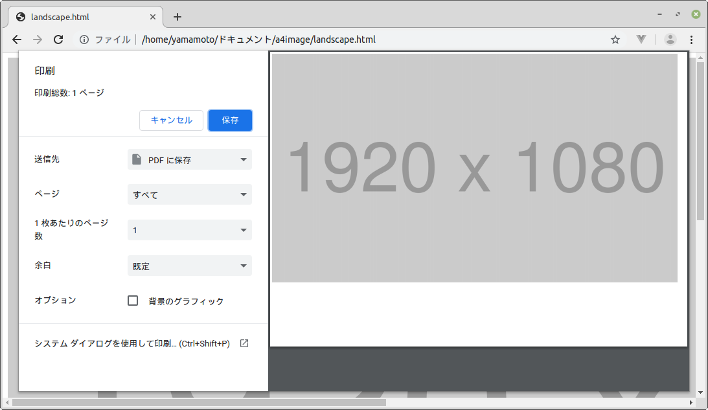
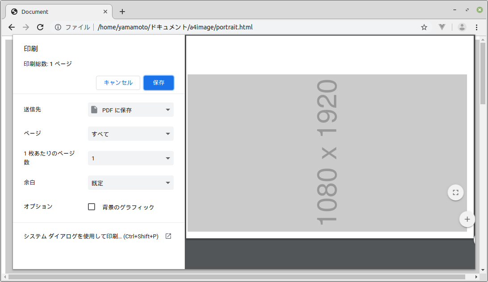

# 大きな画像をA4用紙1枚に入れて印刷するCSS

そのまま印刷するとA4用紙1枚に入り切らない大きな画像がある。

この画像をA4用紙に入れて印刷する。

HTMLファイルとCSSファイルは次のようになる。

HTMLファイル(landscape.html)

    <!DOCTYPE html>
    <html>
    <head>
        <meta charset="UTF-8">
        <link rel="stylesheet" media="all" href="print.css" />
    </head>
    <body>
        

            
        

    </body>
    </html>

print.css

    @media print {
        @page {
            size: A4 landscape;
            margin: 0;
        }
        body {
            height: 200mm;
            width: 287mm;
        }
        /* 印刷したくない領域 */
        .hidden-print {
            display: none;
        }
        /* 印刷したい領域 */
        .content-print-landscape {
            top: 50%;
            left: 50%;
            height: 200mm;
            width: 287mm;
        }
        .content-print-landscape img {
            max-width: 100%;
            max-height: 100%;
            width: auto;
            height: auto;
        }
    }

このCSSは、用紙をA4横にしているため、画像が縦長のときは大きな余白ができる。

画像が縦向きのときは、画像を回転して印刷する。

HTMLファイル(portrait.html)

    <!DOCTYPE html>
    <html>
    <head>
        <meta charset="UTF-8">
        <title>Document</title>
        <link rel="stylesheet" media="all" href="print.css" />
    </head>
    <body>
        

            
        

    </body>
    </html>

CSSファイル

    @media print {
        @page {
            size: A4 landscape;
            margin: 0;
        }
        body {
            height: 200mm;
            width: 287mm;
        }
        /* 印刷したくない領域 */
        .hidden-print {
            display: none;
        }
        /* 印刷したい領域 */
        .content-print-landscape {
            top: 50%;
            left: 50%;
            height: 200mm;
            width: 287mm;
        }
        .content-print-landscape img {
            max-width: 100%;
            max-height: 100%;
            width: auto;
            height: auto;
        }
        .content-print-portrait {
            height: 287mm;
            width: 200mm;
            transform-origin: 100mm 100mm;
            transform: rotate(270deg);
        }
        .content-print-portrait img {
            max-width: 100%;
            max-height: 100%;
            width: auto;
            height: auto;
        }
    }

後は、画像のサイズに合わせてスタイルに「content-print-landscape」か「content-print-portrait」を適用すればいい。

